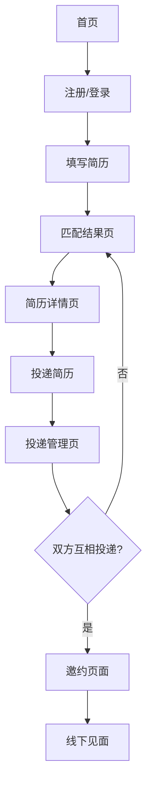

## 1. 产品概述

一个严肃认真的相亲网站，模仿求职流程设计，让用户像找工作一样认真对待相亲。通过AI智能匹配简历，帮助用户找到合适的伴侣。

解决传统相亲平台随意性强、匹配度低的问题，为追求稳定关系的单身人士提供专业、高效的相亲服务。

## 2. 核心功能

### 2.1 用户角色
| 角色 | 注册方式 | 核心权限 |
|------|----------|----------|
| 普通用户 | 邮箱/手机号注册 | 创建简历、浏览匹配、投递申请、接收申请、管理个人资料 |

### 2.2 功能模块

相亲网站主要包含以下页面：
1. **首页**：平台介绍、登录注册入口
2. **简历填写页**：个人信息、条件要求、感情经历填写
3. **匹配结果页**：AI推荐的匹配简历列表
4. **简历详情页**：完整简历信息展示
5. **投递管理页**：投递记录、收到的申请管理
6. **邀约页面**：双方匹配后的线下见面邀约

### 2.3 页面详情

| 页面名称 | 模块名称 | 功能描述 |
|----------|----------|----------|
| 首页 | 导航栏 | 显示平台logo、登录/注册按钮 |
| 首页 | 介绍区域 | 展示平台特色和优势 |
| 简历填写页 | 基本信息 | 填写姓名、年龄、身高、学历、职业、收入等基础信息 |
| 简历填写页 | 感情经历 | 填写过往恋爱经历、分手原因、对感情的看法 |
| 简历填写页 | 择偶要求 | 填写对另一半的年龄、学历、性格等要求 |
| 匹配结果页 | 简历列表 | 显示AI匹配的简历卡片，包含姓名、感情经历摘要、主要要求 |
| 匹配结果页 | 筛选功能 | 支持按年龄、学历等条件筛选 |
| 简历详情页 | 完整信息 | 展示对方的完整简历内容 |
| 简历详情页 | 投递按钮 | 可以选择投递自己的简历给对方 |
| 投递管理页 | 已投递 | 查看自己投递过的简历和状态 |
| 投递管理页 | 收到的申请 | 查看别人投递给自己的简历 |
| 邀约页面 | 邀约发起 | 双方互相投递后，可以发起线下见面邀约 |
| 邀约页面 | 邀约管理 | 查看收到的邀约，选择接受或拒绝 |

## 3. 核心流程

### 用户操作流程
1. 用户注册登录后，首先需要填写完整的个人简历
2. AI系统根据简历内容进行智能匹配，推荐合适的对象
3. 用户浏览匹配结果，查看感兴趣的简历详情
4. 如果满意，可以投递自己的简历给对方
5. 对方收到申请后，可以选择查看申请者的简历
6. 如果双方都投递了对方，则进入互相匹配状态
7. 匹配成功后，可以发起线下见面邀约
8. 双方确认见面时间和地点

## 4. 用户界面设计

### 4.1 设计风格
- **主色调**：温暖粉色系（#FF6B9D）搭配白色，营造温馨浪漫氛围
- **辅助色**：深灰色（#333333）用于文字，浅灰色（#F5F5F5）用于背景
- **按钮样式**：圆角矩形设计，主要按钮使用渐变粉色
- **字体**：中文使用思源黑体，英文使用Inter，正文字号14-16px
- **布局风格**：卡片式布局，顶部导航栏，内容区域居中显示
- **图标风格**：使用线性图标，简洁现代风格

### 4.2 页面设计概览

| 页面名称 | 模块名称 | UI元素 |
|----------|----------|--------|
| 首页 | 导航栏 | 白色背景，粉色logo，右侧登录注册按钮 |
| 首页 | 介绍区域 | 粉色渐变背景，白色文字，配情侣插画 |
| 简历填写页 | 表单区域 | 白色卡片，分组显示，粉色进度条 |
| 匹配结果页 | 简历卡片 | 白色卡片，粉色边框，显示头像和基本信息 |
| 简历详情页 | 信息展示 | 分模块展示，使用图标+文字形式 |
| 投递管理页 | 申请列表 | 标签页切换，状态标识（已投递/已收到） |
| 邀约页面 | 邀约卡片 | 显示邀约信息，粉色接受按钮 |

### 4.3 响应式设计
- 采用桌面端优先设计，适配1200px以上屏幕
- 移动端自适应，使用响应式布局
- 触摸交互优化，按钮大小适合手指点击