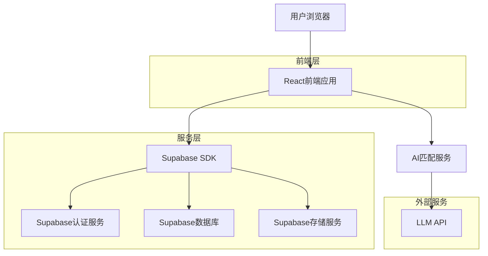
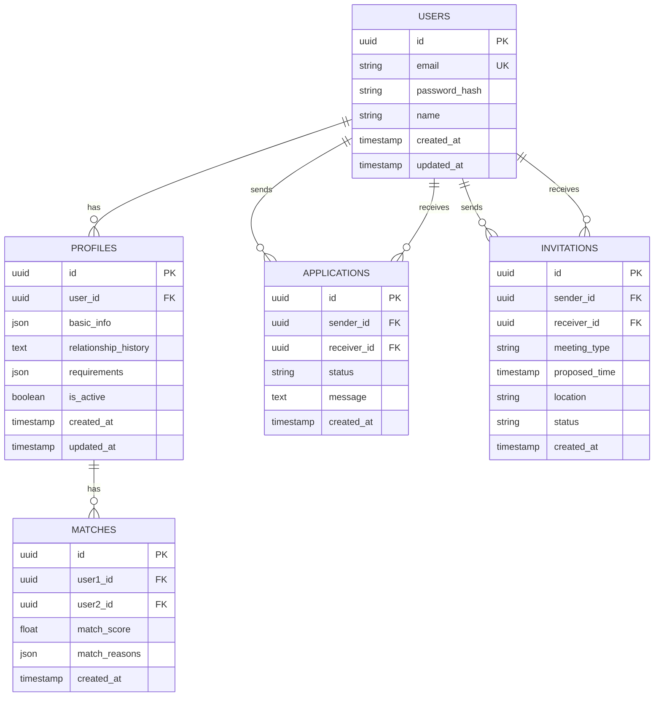

## 1. 架构设计



## 2. 技术描述

- **前端**: React@18 + tailwindcss@3 + vite
- **初始化工具**: vite-init
- **后端**: Supabase (提供认证、数据库、存储服务)
- **AI服务**: 集成LLM API进行智能匹配
- **状态管理**: React Context + useReducer
- **路由**: React Router v6

## 3. 路由定义

| 路由 | 用途 |
|------|------|
| / | 首页，平台介绍和登录入口 |
| /register | 注册页面 |
| /login | 登录页面 |
| /profile/create | 创建简历页面 |
| /profile/edit | 编辑简历页面 |
| /matches | 匹配结果页面 |
| /profile/:id | 简历详情页面 |
| /applications | 投递管理页面 |
| /invitations | 邀约管理页面 |

## 4. API定义

### 4.1 用户认证相关

```
POST /auth/register
```

请求:
| 参数名 | 参数类型 | 是否必需 | 描述 |
|--------|----------|----------|------|
| email | string | 是 | 用户邮箱 |
| password | string | 是 | 用户密码 |
| name | string | 是 | 用户姓名 |

响应:
| 参数名 | 参数类型 | 描述 |
|--------|----------|------|
| user | object | 用户信息 |
| session | object | 会话信息 |

```
POST /auth/login
```

请求:
| 参数名 | 参数类型 | 是否必需 | 描述 |
|--------|----------|----------|------|
| email | string | 是 | 用户邮箱 |
| password | string | 是 | 用户密码 |

### 4.2 简历管理相关

```
POST /api/profiles
```

请求:
| 参数名 | 参数类型 | 是否必需 | 描述 |
|--------|----------|----------|------|
| basic_info | object | 是 | 基本信息（年龄、身高、学历等） |
| relationship_history | string | 是 | 感情经历 |
| requirements | object | 是 | 择偶要求 |

```
GET /api/profiles/matches
```

响应:
| 参数名 | 参数类型 | 描述 |
|--------|----------|------|
| matches | array | 匹配的用户列表 |
| match_score | number | 匹配度分数 |

### 4.3 投递申请相关

```
POST /api/applications
```

请求:
| 参数名 | 参数类型 | 是否必需 | 描述 |
|--------|----------|----------|------|
| target_user_id | string | 是 | 目标用户ID |
| message | string | 否 | 附加消息 |

```
GET /api/applications
```

响应:
| 参数名 | 参数类型 | 描述 |
|--------|----------|------|
| sent | array | 已投递的申请 |
| received | array | 收到的申请 |

### 4.4 邀约相关

```
POST /api/invitations
```

请求:
| 参数名 | 参数类型 | 是否必需 | 描述 |
|--------|----------|----------|------|
| target_user_id | string | 是 | 目标用户ID |
| meeting_type | string | 是 | 见面类型（咖啡/晚餐等） |
| proposed_time | datetime | 是 | 建议时间 |
| location | string | 是 | 地点 |

## 5. 数据模型

### 5.1 数据模型定义



### 5.2 数据定义语言

用户表 (users)
```sql
-- 创建表
CREATE TABLE users (
    id UUID PRIMARY KEY DEFAULT gen_random_uuid(),
    email VARCHAR(255) UNIQUE NOT NULL,
    password_hash VARCHAR(255) NOT NULL,
    name VARCHAR(100) NOT NULL,
    created_at TIMESTAMP WITH TIME ZONE DEFAULT NOW(),
    updated_at TIMESTAMP WITH TIME ZONE DEFAULT NOW()
);

-- 创建索引
CREATE INDEX idx_users_email ON users(email);
```

简历表 (profiles)
```sql
-- 创建表
CREATE TABLE profiles (
    id UUID PRIMARY KEY DEFAULT gen_random_uuid(),
    user_id UUID UNIQUE REFERENCES users(id) ON DELETE CASCADE,
    basic_info JSONB NOT NULL,
    relationship_history TEXT NOT NULL,
    requirements JSONB NOT NULL,
    is_active BOOLEAN DEFAULT true,
    created_at TIMESTAMP WITH TIME ZONE DEFAULT NOW(),
    updated_at TIMESTAMP WITH TIME ZONE DEFAULT NOW()
);

-- 创建索引
CREATE INDEX idx_profiles_user_id ON profiles(user_id);
CREATE INDEX idx_profiles_is_active ON profiles(is_active);
```

申请表 (applications)
```sql
-- 创建表
CREATE TABLE applications (
    id UUID PRIMARY KEY DEFAULT gen_random_uuid(),
    sender_id UUID REFERENCES users(id) ON DELETE CASCADE,
    receiver_id UUID REFERENCES users(id) ON DELETE CASCADE,
    status VARCHAR(20) DEFAULT 'pending' CHECK (status IN ('pending', 'accepted', 'rejected')),
    message TEXT,
    created_at TIMESTAMP WITH TIME ZONE DEFAULT NOW(),
    UNIQUE(sender_id, receiver_id)
);

-- 创建索引
CREATE INDEX idx_applications_sender_id ON applications(sender_id);
CREATE INDEX idx_applications_receiver_id ON applications(receiver_id);
CREATE INDEX idx_applications_status ON applications(status);
```

邀约表 (invitations)
```sql
-- 创建表
CREATE TABLE invitations (
    id UUID PRIMARY KEY DEFAULT gen_random_uuid(),
    sender_id UUID REFERENCES users(id) ON DELETE CASCADE,
    receiver_id UUID REFERENCES users(id) ON DELETE CASCADE,
    meeting_type VARCHAR(50) NOT NULL,
    proposed_time TIMESTAMP WITH TIME ZONE NOT NULL,
    location VARCHAR(255) NOT NULL,
    status VARCHAR(20) DEFAULT 'pending' CHECK (status IN ('pending', 'accepted', 'rejected')),
    created_at TIMESTAMP WITH TIME ZONE DEFAULT NOW()
);

-- 创建索引
CREATE INDEX idx_invitations_sender_id ON invitations(sender_id);
CREATE INDEX idx_invitations_receiver_id ON invitations(receiver_id);
CREATE INDEX idx_invitations_status ON invitations(status);
```

匹配表 (matches)
```sql
-- 创建表
CREATE TABLE matches (
    id UUID PRIMARY KEY DEFAULT gen_random_uuid(),
    user1_id UUID REFERENCES users(id) ON DELETE CASCADE,
    user2_id UUID REFERENCES users(id) ON DELETE CASCADE,
    match_score FLOAT NOT NULL,
    match_reasons JSONB,
    created_at TIMESTAMP WITH TIME ZONE DEFAULT NOW(),
    UNIQUE(LEAST(user1_id, user2_id), GREATEST(user1_id, user2_id))
);

-- 创建索引
CREATE INDEX idx_matches_user1_id ON matches(user1_id);
CREATE INDEX idx_matches_user2_id ON matches(user2_id);
CREATE INDEX idx_matches_score ON matches(match_score DESC);
```

### 5.3 权限设置

```sql
-- 基本读取权限
GRANT SELECT ON users TO anon;
GRANT SELECT ON profiles TO anon;
GRANT SELECT ON matches TO anon;

-- 认证用户完整权限
GRANT ALL PRIVILEGES ON users TO authenticated;
GRANT ALL PRIVILEGES ON profiles TO authenticated;
GRANT ALL PRIVILEGES ON applications TO authenticated;
GRANT ALL PRIVILEGES ON invitations TO authenticated;
GRANT ALL PRIVILEGES ON matches TO authenticated;

-- RLS策略示例
ALTER TABLE profiles ENABLE ROW LEVEL SECURITY;
ALTER TABLE applications ENABLE ROW LEVEL SECURITY;
ALTER TABLE invitations ENABLE ROW LEVEL SECURITY;

-- 用户只能查看自己的完整信息
CREATE POLICY "Users can view own profile" ON profiles
    FOR SELECT USING (auth.uid() = user_id);

-- 用户只能查看活跃的简历
CREATE POLICY "View active profiles" ON profiles
    FOR SELECT USING (is_active = true);

-- 用户只能管理自己的申请
CREATE POLICY "Users can manage own applications" ON applications
    FOR ALL USING (auth.uid() = sender_id OR auth.uid() = receiver_id);
```